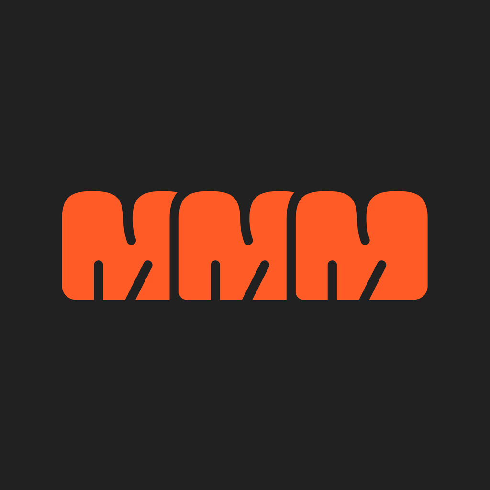
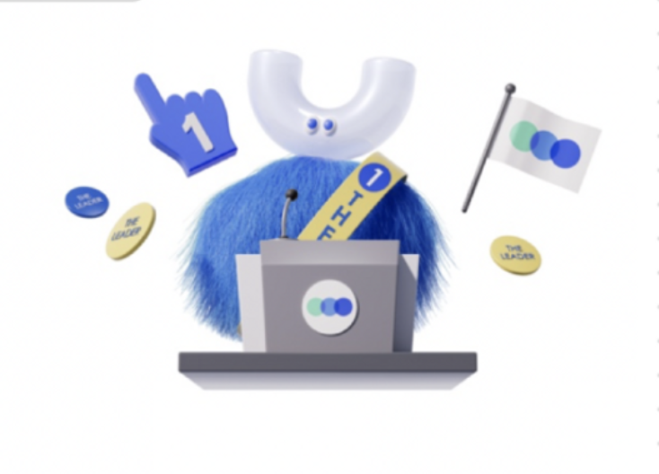
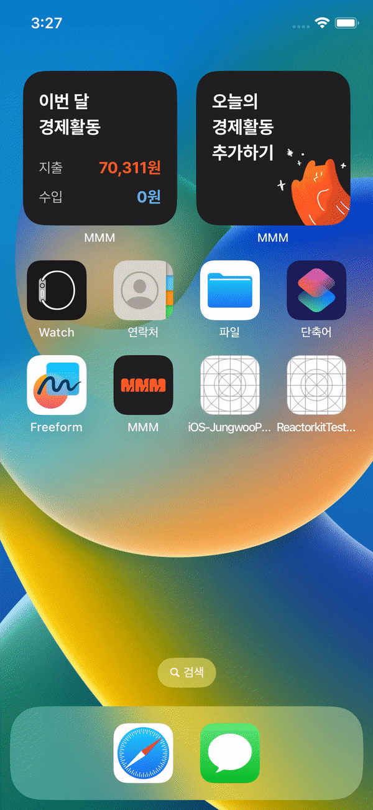
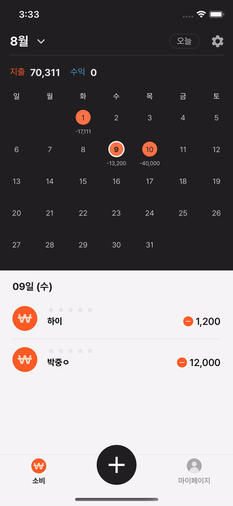

# 🍢 MMM


## 앱 버전 : 2.0.1

### 앱 최소지원 버전 : iOS15
## 👋 앱 소개

<div align="center">
  <table style="font-weight : bold">
      <tr>
          <td align="center">
              <a href="https://www.notion.so/MMM-WHAT-IS-IT-70bb2a477c0a4b20bcc3e213807158bc?pvs=4">                 
                              
              </a>
          </td>
          <td align="center">
              <a href="https://www.notion.so/WHO-WE-ARE-cfbf5a97037a47829cb113b13c658232?pvs=4">                 
                              
              </a>
          </td>
      </tr>
      <tr>
          <td align="center">앱 아이콘</td>
          <td align="center">대표 캐릭터</td>
      </tr>
  </table>
</div>

```
💡 어떻게 돈을 벌고 있는지
💡 내가 올바르고 가치있는 곳에 돈을 쓰는지
💡 확인할 수 있는 수기 가계부 앱
```

<br>

## 👨‍👩‍👧‍👦 참여자
<div align="center">
  <table style="font-weight : bold">
      <tr align="center">
          <td colspan="5"> 팀 목표 : 조급하지 않게! 죽기 전에 하나만 만들어보자!! </td>
      </tr>
      <tr align="center">
          <td align="center">
              <a href="">                 
                              
              </a>
          </td>
          <td align="center">
              <a href="">                 
                              
              </a>
          </td>
          <td align="center">
              <a href="">                 
                              
              </a>
          </td>
      </tr>
      <tr>
          <td align="center">PM / 그로스 마케팅 </td>
          <td align="center">프로덕트 디자인 / 브랜딩 </td>
          <td align="center">프로덕트 디자인 / UX기획 </td>
      </tr>
      <tr>
          <td align="center">
              <a href="https://github.com/GeonHyeongKim">                 
                              
              </a>
          </td>
          <td align="center">
              <a href="https://github.com/jwoo820">                 
                              
              </a>
          </td>
          <td align="center">
              <a href="https://github.com/hyundang">                 
                              
              </a>
          </td>
          <td align="center">
              <a href="https://github.com/ChoiSunPil">                 
                              
              </a>
          </td>
      </tr>
      <tr>
          <td align="center">iOS</td>
          <td align="center">iOS</td>
          <td align="center">Web</td>
          <td align="center">BE</td>
      </tr>
  </table>
</div>

## 📱 스크린샷
<Blockquote>
실제 앱 구동화면입니다
</Blockquote>

### MMM

|  |  |  |  |  |
|:-:|:-:|:-:|:-:|:-:|
| 스플래쉬/로그인 | 홈 | 추가 | 프로필 | 데이터 내보내기 |

<br>

## 🏃‍ 핵심 기능
1. 캘린더 기능
2. 캘린더 사용자 UI 커스텀 기능
3. 경제활동 추가 및 편집 기능
4. 경제활동 정보 .xlsx 파일 내보내기 기능
<br>

## ⚙️ 개발 환경
<details>
<summary>펼처서 보기</summary>
<div markdown="1">

- iOS 15.0 이상
- xcode 13.0
- iPhone 14 Pro에서 최적화됨
- 가로모드 미지원

</div>
</details>


</div>
</details>
<br>

## 🤝 규칙
<details>
<summary>규칙 10가지</summary>
<div markdown="1">

```
1. 스프린트 기한 무조건 마치기
2. 격주 수요일에 회의 진행하기
```

</div>
</details>

<details>
<summary>코드 컨벤션</summary>
<div markdown="1">

- feat/이슈번호-큰기능명/세부기능명
```
- [Feat] 새로운 기능 구현
- [Chore] 코드 수정, 내부 파일 수정, 주석
- [Add] Feat 이외의 부수적인 코드 추가, 라이브러리 추가, 새로운 파일 생성 시, 에셋 추가
- [Fix] 버그, 오류 해결
- [Del] 쓸모없는 코드 삭제
- [Move] 파일 이름/위치 변경
```

</div>
</details>

<details>
<summary>깃 브렌치</summary>
<div markdown="2">

- feat/이슈번호-큰기능명/세부기능명
```
예시)
feat/13-tab1/home
feat/13-tab1/step_one
feat/26-tab2/step_two
```

</div>
</details>


<details>
<summary>MMM 폴더링 컨벤션</summary>
<div markdown="3">

```
📦 MMM
| 
+ 🗂 App                        // AppDelegate, SeneDelegate
|
+ 🗂 Resources       
|        
+------🗂 Assets                // AppIcone, Color, Image Assets
|
+------🗂 Base                  // 상속하는 base codee
│         
+------🗂 Configuration         // KeyChain 저장을 위한 클래스
|
+------🗂 Extensions            // extension 모음
│         
+------🗂 Fonts                 // 폰트 모음 : 무료 폰트인 Pretendard 사용
|
+------🗂 Info                  // 파일 설정 모음
│         
+ 🗂 Sources
|
+------🗂 Models                // Json을 받기 위한 Hashable, Codable, Identifiable 프로토콜을 체택한 struct 관리
│         
+------🗂 Services              // Network를 위한 Constants, Client, Parmeters, Router
|
+------🗂 Utilities             // ObservableObject을 체택하여 네트워크 관리
|
+------🗂 ViewController                 // Log, Traking Enum
        |
        +------🗂 Add           // Tab 2
        │         
        +------🗂 Home          // Tab 1
        |
        +------🗂 HomeDetail    
        |
        +------🗂 Onboarding    
        │         
        +------🗂 Profile       // Tab 3
        |
        +------🗂 TabBar      
           
```
</div>
</details>
<br>

<!-- ## 라이센스
Machacha is available under the MIT license. See the [LICENSE](https://github.com/APPSCHOOL1-REPO/finalproject-machacha/blob/main/LICENSE) file for more info.

- [Google MLKit](https://developers.google.com/ml-kit/terms) 
- [InstantSearchVoiceOverlay](https://github.com/algolia/voice-overlay-ios)
- [Kingfisher](https://github.com/onevcat/Kingfisher)
- [FlagKit](https://github.com/madebybowtie/FlagKit)
- [AlertToast](https://github.com/elai950/AlertToast)
 -->
